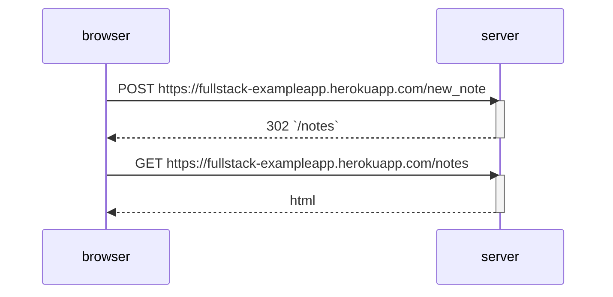

When a user creates a new note on the page and clicks submit.

- Post https://fullstack-exampleapp.herokuapp.com/new_note
- gets response 302
  Which is a redirect to `/notes`.
- Get /notes
-

```mermaid
sequenceDiagram
	participant browser
	participant server

	browser->>server: POST https://fullstack-exampleapp.herokuapp.com/new_note
	activate server
	server-->>browser: 302 `/notes`
	deactivate server

	browser->>server: GET https://fullstack-exampleapp.herokuapp.com/notes
	activate server
	server-->>browser: html
	deactivate server
```
