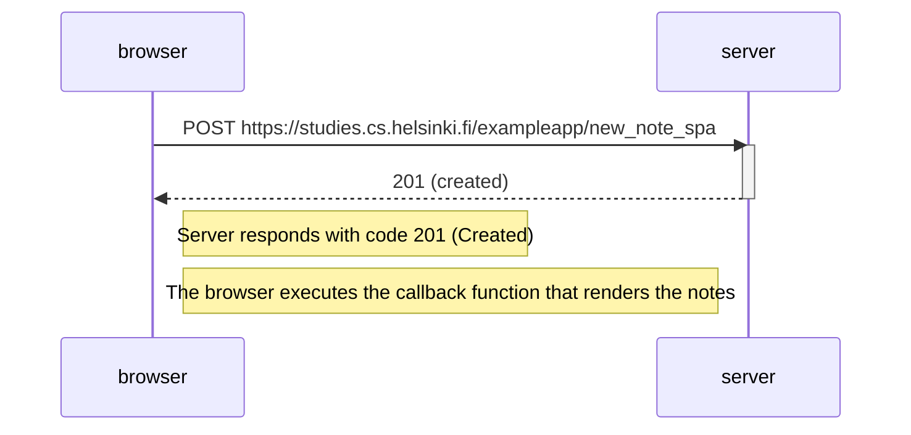

```mermaid
sequenceDiagram
	participant browser
	participant server

	browser->>server: POST https://studies.cs.helsinki.fi/exampleapp/new_note_spa
    activate server
    server-->>browser: 201 (created)
    deactivate server

	Note right of browser: Server responds with code 201 (Created)

	Note right of browser: The browser executes the callback function that renders the notes
```
